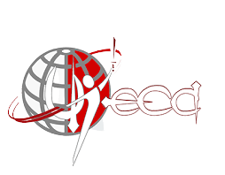

<!DOCTYPE html>
<html lang="es">
<head>
<meta charset="UTF-8">
<title>Congreso Juvenil 2026 | UJERCA</title>
<meta name="viewport" content="width=device-width, initial-scale=1.0">

<!-- Fuente -->
<link href="https://fonts.googleapis.com/css2?family=Poppins:wght@300;400;600;700&display=swap" rel="stylesheet">

<!-- Favicon LOCAL -->
<link rel="icon" href="img/favicon.ico">

</head>

<body>

<!-- NAVBAR -->
<nav class="navbar">
    

        
        <strong>UJERCA</strong>
    

    <a href="#formulario" class="nav-btn">Inscribirme</a>
</nav>

<!-- HERO -->
<header class="hero">

    
    <h1>Congreso Juvenil 2026</h1>
    
Circuito 2 - Zona 6

    

        
0 Días

        
0 Horas

        
0 Min

        
0 Seg

    

     
    <a href="#formulario" class="btn-primary">Preinscribirme</a>

</header>

<!-- INFO -->
<section class="info">
<h2>Un Encuentro que Transformará tu Vida</h2>

📅 15 - 17 Julio 2026

📍 Circuito 2 Zona 6 - Caribe

Un tiempo especial de adoración, palabra y crecimiento espiritual.

</section>

<!-- INVITADOS -->
<section class="invitados">
<h2>Invitados Especiales</h2>

<h3>Invitado 1</h3>

Orador principal

<h3>Invitado 2</h3>

Talleres

<h3>Grupo de Alabanza</h3>

Adoración en vivo

</section>

<!-- FORM -->
<section id="formulario" class="form-section">
<h2>Formulario de Preinscripción</h2>

<iframe src="https://docs.google.com/forms/d/e/1FAIpQLSfJeRfjRysZH4qcuW61IkezIdhXQoBJrIFlZGjjLMLj6QoccQ/viewform?embedded=true">
Cargando…
</iframe>

</section>

<footer>
© 2026 UJERCA - Congreso Juvenil
</footer>

<!-- WhatsApp -->

<a href="https://wa.me/573000000000" target="_blank">📱</a>

</body>
</html>
